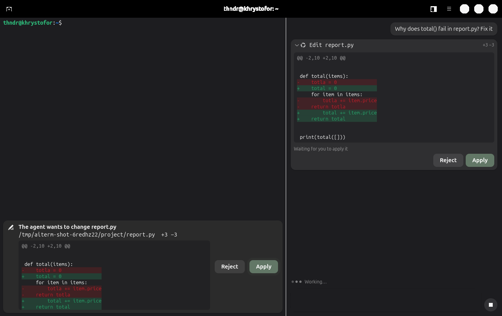

# v1.1 plan: the agent's file edits as diffs

Goal: when the agent changes a file, the user sees the change as a diff
and applies it, the way they click Run for a command. Nothing is written
until then.



## How it works

```
 agy ──MCP── aiterm-mcp ──D-Bus── Aiterm
             edit_file             ProposeEdit(path, before, after)
             write_file              ├─ "edit-proposed" → the chat's card shows the diff
                                     ├─ the bar above the terminal: Apply / Reject
                                     └─ Apply: the file still holds `before`? write `after`
```

- **The agent edits through aiterm.** Two new MCP tools: `edit_file`
  (replace `old_text` with `new_text`, once or with `replace_all`) and
  `write_file` (create a file or replace all of it). The plugin's rules
  tell the agent to use them instead of its own file tools and of
  `sed -i` / `echo >`.
- **The server plans, the app decides.** The MCP server reads the file and
  works out its text before and after (`src/aiterm/edits.py`); mistakes the
  model can fix (text not found, found twice, not UTF-8) come back at once,
  before the user is asked anything. Then it calls `ProposeEdit` on the
  terminal API and waits.
- **Approval lives in the app**, as for commands: the bar above the
  terminal shows the file, `+3 −1` and the diff, with Apply / Reject; the
  chat shows the same change as a card with the same buttons. A preference
  (Preferences → Agent → Files) turns asking off; the change is still
  shown in the chat.
- **Safe writes.** On Apply, the app checks that the file still holds the
  text the diff was made from (the user may have edited it meanwhile), then
  writes a temporary file next to it and renames it over the file, keeping
  its mode. A changed file is left alone and the model is told to read it
  again.
- **agy's own file tools** still exist (we do not turn them off in agy's
  settings, which apply outside aiterm too). If the agent uses them anyway,
  the chat shows their diff from the tool's parameters, marked "Written by
  agy's own file tool, without asking", with no buttons: agy has already
  written the file by then.

## Steps

1. [x] `edits.py`: plan, diff, atomic write with the stale-file check, and
   agy's own tools' parameters as a diff. Unit tests (`tests/edits_unit.py`).
2. [x] `edit_file` / `write_file` in the MCP server, `ProposeEdit` in the
   D-Bus API and the client, the approval bar for edits, the preference.
3. [x] The chat's edit card (`EditRow`, `diff_view.py`); the fake agy can
   edit through the real tool, so the smoke test clicks Apply and Reject.
4. [x] Rules, README, evals with nobody to click Apply.
5. [x] Undo: once a change is written, its card in the chat offers Undo,
   which puts the file back (or removes the file the change created) if
   nothing changed it since (`edits.undo`). The agent is not told; it reads
   a file again before its next edit to it.

## After the release

- [x] Line numbers in the diff, old and new, read from the hunk headers
  (`edits.numbered()`); agy's own tools' diffs count from the line agy names.

## Out of scope

- Editing the proposed change before applying it
- A side-by-side diff
